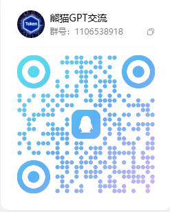

# free-codex-agent

Codex Agent Identity ??????? sub2api ?????

## ??

- ?????? `accessToken` / `session.json` / `auth.json`
- ????????? Agent Identity `auth.json`
- ?????????`summary.json`?`summary.csv`?`errors.jsonl`
- Web ?????/??????????????? sub ??
- ??????????? sub2api ????
- ???? sub ???????????????

## ??

```bash
pip install -r requirements.txt
```

## ?? Web ??

```bash
python codex_agent_web.py
```

?????

```text
http://127.0.0.1:8765
```

## ?????

???????

```bash
python codex_agent.py --batch tokens.txt --out-dir results
```

?????? sub2api?

```bash
python codex_agent.py ^
  --batch tokens.txt ^
  --out-dir results ^
  --sub-url "https://??sub??" ^
  --sub-email "admin@example.com" ^
  --sub-import ^
  --sub-group-id 3
```

?? sub ???

```bash
python codex_agent.py ^
  --sub-url "https://??sub??" ^
  --sub-email "admin@example.com" ^
  --sub-test
```

## sub2api ????

???? sub2api ?????

- `POST /api/v1/auth/login`
- `GET /api/v1/admin/groups/all`
- `POST /api/v1/admin/accounts/import/codex-session`
- `POST /api/v1/admin/accounts/:id/test`

## ????

```text
results/
  YYYYMMDD-HHMMSS/
    auth/
      001_xxx_auth.json
    sub_import_payload.json
    sub_import_result.json
    summary.json
    summary.csv
    errors.jsonl
```

## ????

- `auth.json` / `*_auth.json` ?? `agent_private_key`?????? git?
- `results/`?`tokens.txt`?`session.json`?`auth.json` ??? `.gitignore`?
- Web ????? sub ???????? `localStorage` ?????? AT/?????

## ??GPT??

????????



???`1106538918`
